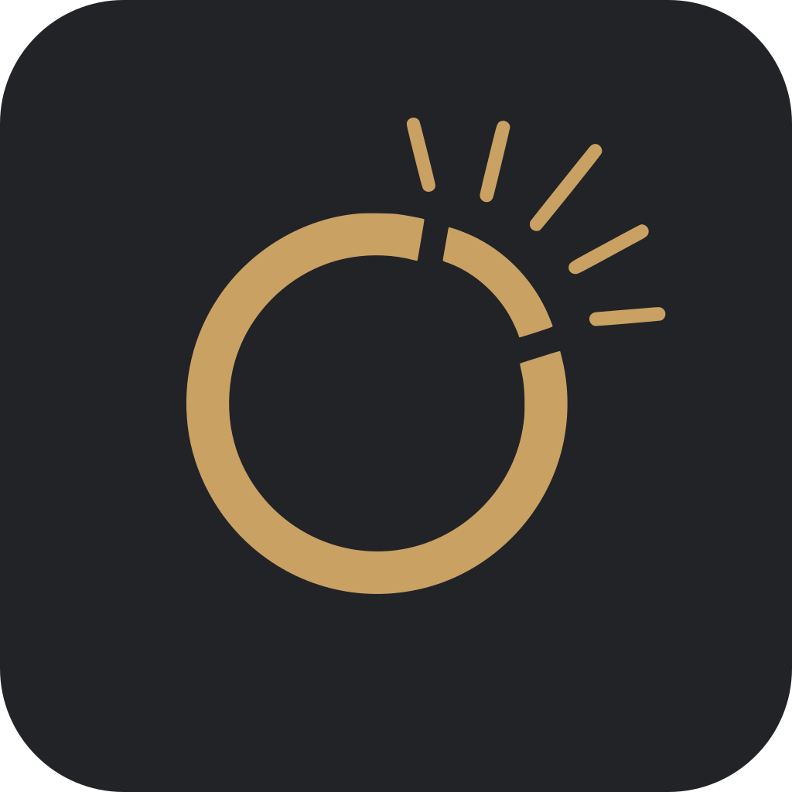
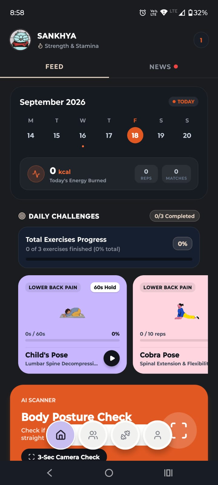
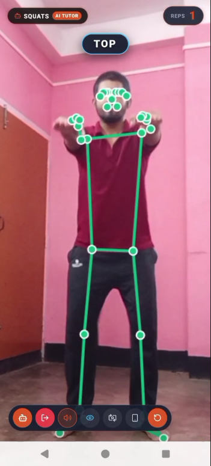
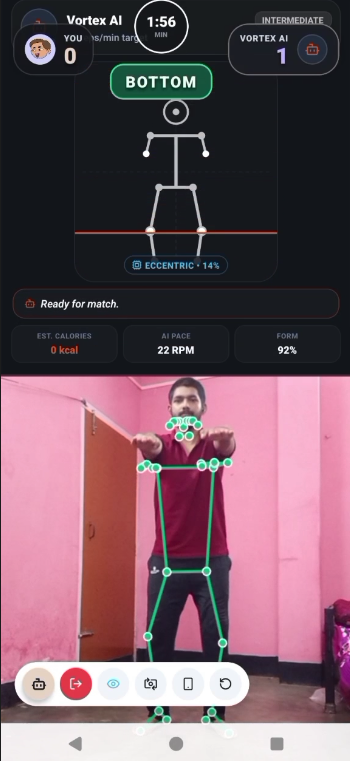

<p align="center">
  
</p>

<h1 align="center">Ojas — AI Workout & Fitness Battles</h1>

<p align="center">
  <b>A smart mobile fitness app that uses your phone's camera to track your workouts in real time, count your reps, check your posture, and let you battle friends or AI.</b>
</p>

<p align="center">
  
</p>

---

## App Features

### 1. AI Workout Coach (Camera Tracking)
- Uses your mobile camera to track your movements in real time.
- Automatically counts every good rep you complete.
- Gives live audio and visual form tips to keep your posture safe.
- **100% On-Device**: Camera frames never leave your phone.

<p align="center">
  
</p>

---

### 2. Human vs AI Duels
- Jump into a 2-minute workout battle against an AI opponent.
- 4 difficulty levels: **Beginner**, **Intermediate**, **Advanced**, and **Pro**.
- Real-time calorie burn and rep comparison.

<p align="center">
  
</p>

---

### 3. AI Body Posture Scanner
- Quick 3-second full-body camera scan.
- Checks shoulder level, knee alignment, and spine straightness.
- Suggests targeted daily exercises to fix posture issues.

<p align="center">
  
</p>

---

### 4. Live 1v1 Multiplayer Battles
- Real-time 2-minute split-screen battles with friends or matched players.
- Live video stream and rep counter synchronization.
- Compete to see who gets the highest clean rep count.

<p align="center">
  
</p>

---

### 5. Friends, Streaks & Daily Challenges
- Add fitness friends and send instant 1-tap battle invites.
- Daily workout challenges and streak counters to keep you consistent.
- Track total calories burned, workout time, and level progress.

<p align="center">
  
</p>

---

## Supported Exercises

| Exercise | What the AI Checks |
|---|---|
| **Squats** | Knee bend depth, back posture, standing lockout |
| **Push-ups** | Chest drop depth, arm extension, straight core |
| **Lunges** | Front knee angle, back knee clearance, vertical spine |
| **Crunches** | Shoulder lift angle, core contraction without neck pulling |
| **Triangle Pose** | Leg straightness, lateral hip hinge, arm reach |
| **Cobra Pose** | Chest elevation, lower back arch, neck alignment |
| **Child's Pose** | Deep hip rest, arm stretch, relaxing hold timer |

<p align="center">
  
</p>

---

## How to Start the Backend Server

The backend runs a Python FastAPI server for WebSocket multiplayer rooms and MediaPipe support.

### 1. Requirements
- Python 3.10 or higher
- pip

### 2. Install Dependencies
```bash
pip install -r backend/requirements.txt
```

### 3. Run the Server
From the project root directory:
```bash
python backend/server.py
```
The server will start on port `8000` (e.g. `http://localhost:8000`).

---

## How to Run the Mobile App

### 1. Requirements
- Node.js (v18+)
- npm or yarn
- Android phone (with USB debugging enabled) or Android Studio emulator

### 2. Install Packages
```bash
npm install
```

### 3. Setup Environment
Create a `.env` file in the project root:
```env
EXPO_PUBLIC_BACKEND_URL=https://app.codequestpro.in
CLOUDFLARE_TUNNEL_TOKEN=your_token_here
```

### 4. Start the Metro Server
```bash
npx expo start
```

### 5. Run on Connected Android Device
```bash
npx expo run:android
```

---

## Built With

| Layer | Technology |
|---|---|
| **Mobile Framework** | React Native & Expo SDK 57 |
| **Language** | TypeScript & Python |
| **AI Pose Engine** | MediaPipe Pose (On-Device GPU acceleration) |
| **Backend Framework** | FastAPI & Uvicorn |
| **Database & Auth** | Supabase (Database, Auth, Channels) |
| **Live Match Server** | WebSocket Server |
| **Icons & UI** | Lucide Icons & Custom SVG Vector Graphics |

---

## License
This project is licensed under the MIT License.
